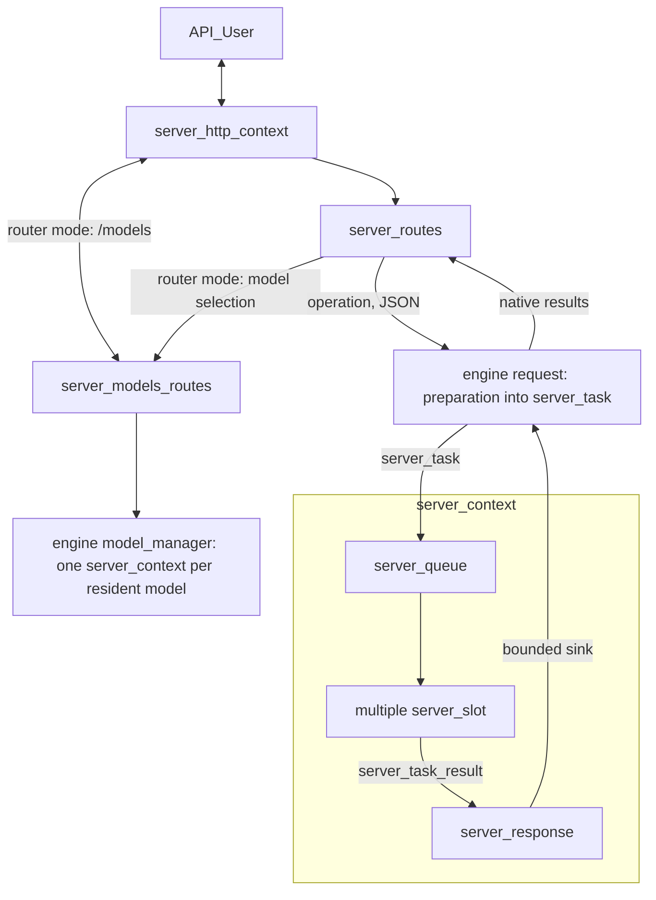
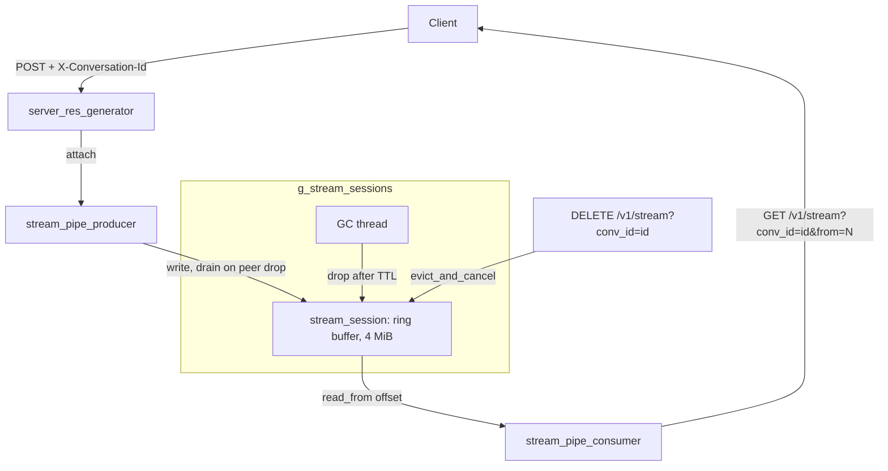

# llama-server Development Documentation

This document provides an in-depth technical overview of `llama-server`, intended for maintainers and contributors.

If you are an end user consuming `llama-server` as a product, please refer to the main [README](./README.md) instead.

## Scope of features

In-scope types of feature:

- Backend:
    - Basic inference features: text completion, embeddings output
    - Chat-oriented features: chat completion, tool calling
    - Third-party API compatibility, e.g. OAI-compat, Anthropic-compat
    - Multimodal input/output
    - Memory management: save/load state, context checkpoints
    - Model management
    - Features that are required by the Web UI
- Frontend:
    - Chat-oriented features, example: basic chat, image upload, edit messages
    - Agentic features, example: MCP
    - Model management

Note: For security reasons, features that require reading or writing external files must be **disabled by default**. This covers features like: MCP, model save/load

Out-of-scope features:

- Backend:
    - Features that require a loop of external API calls, e.g. server-side agentic loop. This is because external API calls in C++ are costly to maintain. Any complex third-party logic should be implemented outside of server code.
    - Features that expose the internal state of the model to the API, example: getting the intermediate activation from API. This is because llama.cpp doesn't support a stable API for doing this, and relying on `eval_callback` can make it complicated to maintain as this API is not intended to be used in multi-sequence setup.
    - Model-specific features. All API calls and features must remain model-agnostic.
- Frontend:
    - Third-party plugins, it is costly to maintain a public plugin API for such features. Instead, users can make their own MCP server for their needs.
    - Customizable themes, it is also costly to maintain. While we do focus on the aesthetic, we try to achieve this by perfecting a small set of themes.
    - Browser-specific features, example: [Chrome's built-in AI API](https://developer.chrome.com/docs/ai/built-in-apis).

## Backend

### Overview

The server supports two primary operating modes:

- **Inference mode**: The default mode for performing inference with a single loaded GGUF model.
- **Router mode** (multi-model mode): serves several models behind a single API endpoint. The models are loaded, put to sleep, evicted and unloaded in the server process by the engine's catalog; each request is routed to the model it names. No child process and no port is used for inference.

The core architecture consists of the following components:

Inference runs in `llama-engine` (`engine/`), shared with `llama-cli` and any
application that embeds llama.cpp (see the
[design](../../docs/design/embedded-inference-engine.md)). The engine owns the
decoder, the JSON operations (validation, conversion, templates, tool-call
production), bounded request queues, per-request conversion state and, in
router mode, the catalog of models. Its public interface is
[`include/llama-engine.h`](../../include/llama-engine.h), documented in the
[API guide](../../docs/design/embedded-inference-engine-api.md) with a compiled
example (`examples/engine-simple`). The server is a privileged in-tree
consumer: it links `llama-engine-internal`, the private interface of the
engine, to read native results (`read_native`) and serialize them exactly as
before the engine, and to drive the catalog (`model_manager`). HTTP handlers
and direct callers run the same operations; the server configures
upstream-compatible unbounded admission and buffering. SSE framing,
keep-alives, stream resumption, Prometheus text, HTTP guards, executed tools and
MCP stay in `tools/server/`, which the engine never includes. `llama-cli` does
not depend on the server: its local mode uses the public engine interface and
its `--server-base` mode is an HTTP client.

The private engine types keep the `server_*` names they had in `llama-server`
(`server_context`, `server_task`, `server_queue`, ...), and the files that hold
them keep theirs (`engine/server-*.cpp`), so that upstream changes of the
server still apply to them.

Model configuration is shared with the engine as well: the post-parse
adjustments of `llama-server` (automatic slots, embedding batch, KV pool per
slot, default alias) live in `llama_engine::detail::apply_server_defaults`, and
the router reads its model sources (cache, `--models-dir`, `--models-preset`,
router arguments, `dedup-cache-models`) through `llama_engine::read_catalog` in
`engine/engine-catalog.cpp`. Any change to option priorities belongs there, not
in `server-models.cpp`. New command-line options must be classified in
`engine/engine-options.cpp` (engine, host or catalog); `test-engine-options`
fails otherwise.

- `server_context` (`engine/engine-context.*`): Holds the inference state of one model, including the main `llama_context` and all active slots. Its decoder runs on a thread owned by the engine; the single-model server starts it and waits for it (`start()`, `join()`), in router mode the catalog creates one per resident model.
- `server_slot`: An abstraction over a single “sequence” in llama.cpp, responsible for managing individual parallel inference requests.
- `server_routes`: Middleware layer between `server_context` and the HTTP interface; parses transport bodies, delegates operations and formats transport responses.
- `server_http_context`: Implements the HTTP server using `cpp-httplib`.
- `server_queue`: Thread-safe queue used by the engine's requests to submit new tasks to `server_context`.
- `server_response`: Delivers the results of `server_context` to the bounded buffer of the request that owns the task (one sink per task).
- `llama_engine::request` / `detail::request_state`: Handle of one submitted operation; the HTTP adapter reads its native results and owns it until the response (or its resumable session) ends.
- `server_task`: Unit of work pushed into `server_queue`.
- `server_task_result`: Unit of result pushed into `server_response`.
- `server_tokens`: Unified representation of token sequences (supports both text and multimodal tokens); used by `server_task` and `server_slot`.
- `server_prompt_checkpoint`: For recurrent (e.g., RWKV) and SWA models, stores snapshots of KV cache state. Enables reuse when subsequent requests share the same prompt prefix, saving redundant computation.
- `server_models_routes` (`server-models.cpp`): HTTP adapter of router mode over the engine's `model_manager` (`engine/engine-models.h`). It builds the catalog sources from the command line, the environment and the configuration files, serves the `/models` routes, translates catalog events into the `/models/sse` events and gives `server_routes` the model selection (`server_model_routing`). Inference routes then go through the same `handle_operation` as with one model.
- `stream_session_manager`: process wide owner of resumable SSE stream sessions, keyed by conversation id. A file-static singleton inside `server-stream.cpp`, driven through `server_stream_session_manager_start/stop`. Backs the replay buffer that lets a client reattach to a generation after an HTTP disconnect. See the "Resumable streaming" section below.



### Batching

The server context maintains a single batch shared across all slots. When `update_slots()` is invoked, the system iterates through all active slots to populate this batch. For each slot, either a generated token from the previous decoding step or available prompt tokens are added to the batch.

Batching constraints apply: slots can only be batched together if they share compatible configurations. For instance, slots using a specific LoRA adapter can be batched with each other, but not with slots using a different LoRA adapter or no adapter at all.

Once the batch reaches capacity or all slots have been processed, `llama_decode` is called to execute the inference. This operation represents the primary computational bottleneck in `update_slots()`.

Following decoding, the system either retrieves embeddings or samples the next token using `common_sampler_sample`. If a slot has remaining prompt tokens to process, it yields until the next `update_slots()` iteration.

### Thread Management

`server_context` runs on a dedicated single thread. Because it is single-threaded, heavy post-processing (especially after token generation) should be avoided, as it directly impacts multi-sequence throughput.

Each incoming HTTP request is handled by its own thread managed by the HTTP library. The following operations are performed in HTTP worker threads:

- JSON request parsing
- Chat template application
- Tokenization
- Conversion of `server_task_result` into final JSON response
- Error formatting into JSON
- Tracking of partial/incremental responses (e.g., streaming tool calls or reasoning steps)

**Best practices to follow:**

- Transport-independent JSON validation/conversion and chat template logic belong in the shared engine, **outside the decoder loop**. HTTP workers call the engine operation runtime; moving a source file must not move heavy processing onto the decode thread.
- HTTP owns multipart adaptation, status/header mapping, SSE wire encoding, keep-alives and replay, not a second implementation of inference JSON contracts.
- Avoid passing raw JSON into `server_slot`. Prepare native task data before admission to the decoder, while keeping the consumer-facing request/result contract JSON-based.

### Example trace of a request

Here is an example trace of an API request for text completion:

- HTTP parses the body and translates multipart files or URL parameters.
- `server_routes::handle_operation` submits the named engine operation and owns its request handle.
- `engine-operations.cpp` validates/converts the JSON and prepares tasks on the submitting thread, with model resources pinned through admission.
- The engine registers bounded result sinks and posts the existing scheduler tasks. HTTP configures unbounded limits to preserve upstream behavior.
- `server_context` moves the task into a slot and decodes using the existing batching, cache and sampling algorithms.
- Results go directly to the request sink. Its `task_result_state` tracks tool/reasoning deltas on the reading thread, outside the decoder.
- The reader receives all business payloads followed by one terminal outcome. Non-streamed assembly also belongs to the engine.
- HTTP encodes SSE, including named Responses/Anthropic events and keep-alives during timed reads. Errors before streaming remain ordinary HTTP errors.
- Metadata and sleeping metrics are owned snapshots. Reads of models, properties or metrics do not request a wake-up.

### Resumable streaming (SSE replay buffer)

By default a streaming generation is bound to its HTTP socket: when the socket drops (refresh, tab close, mobile background, transient network) the generation aborts and the live stream is lost. This feature keeps the generation running server side and lets a client reattach.

It is opt in via the `X-Conversation-Id` header on `POST /v1/chat/completions`. Without the header the OAI strict path is unchanged. The conversation id is the only identity end to end (server map key, client localStorage key, route path), with an optional `::model` suffix for direct routing in router mode.

The feature lives entirely in `server-stream.{h,cpp}` and rests on three types:

- `stream_session`: a bounded ring buffer (4 MiB cap, oldest bytes drop first) plus a condvar. `append` pushes raw SSE bytes, `read_from` drains from any offset and blocks for live bytes or finalize, `finalize` wakes readers, `cancel` sets the flag the producer polls. One conv maps to at most one live session.
- `stream_session_manager`: a file-static singleton (`g_stream_sessions`) inside `server-stream.cpp`, owns all sessions keyed by conv id, enforces the one conv one session invariant via `create_or_replace`, and runs a GC thread that drops completed sessions past their TTL. Exposed to main only through `server_stream_session_manager_start/stop`.
- `stream_pipe_producer` / `stream_pipe_consumer`: the write and read ends. The producer owns the session lifetime and finalizes it on destruction; the consumer is read only and never finalizes, so a reader detaching cannot kill a running generation.

The implementation is hidden in `server-stream.cpp` (pimpl). The header exposes only the route handler factories, the `server_res_spipe` response base, `server_stream_conv_id_from_headers` and the GC lifecycle; the session, manager, consumer and the `server_stream_create_spipe` factory stay in the `.cpp`.

Producer side: `server_res_generator` extends `server_res_spipe`, which keeps all spipe logic out of the generic `server_http_res`. `set_req` attaches a producer when the header is present, and the wrapped `next` tees each chunk into the ring before the socket, so a chunk lost to a dead wire is already buffered. While attached, `should_stop` ignores peer disconnect: only a `DELETE` stops generation. On an early peer drop, `on_complete` drains the tail into the ring on the http worker.

Lifetime safety: the session holds no back reference to the response, so `spipe` is a plain `unique_ptr` touched only by the http worker. `cancel` raises an atomic the producer polls; the producer finalizes the session from its destructor, which also destroys the engine request handle and so cancels the generation. A `DELETE` stops work by raising the flag and letting the worker unwind.

Consumer side: `GET /v1/stream?conv_id=<id>&from=N` opens a `text/event-stream` that replays buffered bytes from offset `N` and blocks for live bytes, so the browser reattaches like a fresh EventSource. An offset below the dropped prefix returns 400.

Routes:

- `GET /v1/stream?conv_id=<id>&from=N`: replay or live reattach. The id travels in the query string because it can embed a model name containing slashes.
- `POST /v1/streams/lookup` with `{"conversation_ids": [...]}`: returns session status only for ids the caller already owns. There is no listing route, so live sessions cannot be enumerated (an earlier `GET /v1/streams` was removed for exactly this reason).
- `DELETE /v1/stream?conv_id=<id>`: explicit Stop, idempotent (`evict_and_cancel`).

Router mode uses the same session registry: the models run in the server process, so no lookup crosses a process. Only one difference remains, for requests that still wait for their model (loading, or queued for a slot): the session exists from the POST, but `GET /v1/stream` answers 503 "Stream owner model is loading, retry later" and `POST /v1/streams/lookup` does not list it until the request stops waiting, as the former router did. A `DELETE` during that wait cancels the request, which answers 400 "request cancelled by a stop while the model was loading". A client that disconnects during the wait does not cancel a session request.

Lifecycle: `server_stream_session_manager_start()` runs in main after common init, `server_stream_session_manager_stop()` runs first in `clean_up()` and finalizes every live session so no reader hangs. Reader blocking and the post drop drain both run on httplib worker threads, which block on a condvar rather than spin.

| Constant | Value | Role |
| --- | --- | --- |
| `STREAM_SESSION_TTL_SECONDS` | 300 | retention of a completed session before GC |
| `STREAM_SESSION_MAX_BYTES` | 4 MiB | ring cap per session |
| `STREAM_SESSION_GC_INTERVAL_SECONDS` | 60 | GC tick |
| `STREAM_READ_WAKE_INTERVAL_MS` | 200 | read_from wake to recheck should_stop |



The diagram shows the buffer touch points. The live wire (chunks streamed to the original client during a normal generation) is the producer's default output, described under "Producer side" above.

### Testing

`llama-server` includes an automated test suite based on `pytest`.

The framework automatically starts a `llama-server` instance, sends requests, and validates responses.

For detailed instructions, see the [test documentation](./tests/README.md).

### API for tools

This endpoint is intended to be used internally by the Web UI and subject to change or to be removed in the future.

**GET /tools**

Get a list of tools, each tool has these fields:
- `tool` (string): the ID name of the tool, to be used in POST call. Example: `read_file`
- `display_name` (string): the name to be displayed on UI. Example: `Read file`
- `type` (string): `"server"` for a server tool, or `"mcp"` for a tool exposed by an MCP server
- `permissions` (object): a mapping string --> boolean that indicates the permission required by this tool. This is useful for the UI to ask the user before calling the tool. For now, the only permission supported is `"write"`
- `definition` (object): the OAI-compat definition of this tool

**POST /tools**

Invoke a tool call, request body is a JSON object with:
- `tool` (string): the name of the tool
- `params` (object): a mapping from argument name (string) to argument value

Headers:
- `x-tool-cwd`: optional; if set, use as the CWD for tool; this is not part of tool's params because it's meant to be set by the runtime, not the LLM itself
- `x-tool-runtime`: optional; if set, run the tool inside this isolate instead of on the host. Either `docker-container:<id>` or `podman-container:<id>`, using an already-running container, or `ssh:<target>`, running the tool on a remote host

Returns JSON object. There are two response formats (MCP tools use the same two formats: their result content is concatenated into `plain_text_response`, and RPC or tool errors are surfaced as the `error` string):

Format 1: Plain text. The text will be placed into a field called `plain_text_response`, example:

```json
{
    "plain_text_response": "this is a text response"
}
```

The client should extract this value and place it inside message content (note: content is no longer a JSON), example

```json
{
    "role": "tool",
    "content": "this is a text response"
}
```

Format 2: Normal JSON response, example:

```json
{
    "error": "cannot open this file"
}
```

That requires `JSON.stringify` when formatted to message content:

```json
{
    "role": "tool",
    "content": "{\"error\":\"cannot open this file\"}"
}
```

Set `stream: true` in the request body to stream a tool's output as it runs, instead of waiting for it to finish. Only certain tools accept this (for ex. `exec_shell_command`);
returns 404 if tool doesn't support it.

Response is SSE stream, one `data: <json>` line per chunk:

```json
{"chunk": "hello\n"}
```

followed by a final event once the tool returns:

```json
{"done": true}
```

or, if `invoke()` threw:

```json
{"done": true, "error": "..."}
```

There is no `[DONE]` sentinel (unlike `/chat/completions`), the stream ends after the `done`

### Router mode: models in the server process

`server_models_routes` creates the engine's catalog (`llama_engine::detail::make_catalog_manager`) with:
- the sources of the former router: cache, `--models-dir`, `--models-preset`; the server's command line over every model (without its reserved options: API keys, TLS files, `--models-*`, model identity, `--log-file`); and, under every model, the `LLAMA_ARG_*` variables and the configuration files that each child process used to read (`catalog_sources::defaults`),
- `--models-max`, `--models-autoload` (overridden per request by `?autoload=`), requests that wait for their model without time or count limit, and the unbounded admission/event/body limits of the single-model server,
- a backend factory that gives each model the HTTP-facing settings its requests and properties read (SSE ping interval, verbosity, UI settings, endpoint flags, per-model host options of its preset) and names it with its catalog id.

The engine keeps the queue order (first come, first served per model), LRU eviction of idle models only, coalesced loads, per-model sleep and unloads that end the model's requests. `LLAMA_SERVER_DEBUG_FAKE_TIMING` still delays loads and admissions by 2 s so that tests can observe queued, loading and busy models. While a request waits for its model, the handler checks its client every 200 ms (`MODEL_WAIT_POLLING`, the former router's interval): a client that left stops counting as a waiter before the busy model goes idle, so it cannot cause an eviction.

Fields and options that described a child process are adapted, not emulated:

| Former router | Router mode in one process |
| --- | --- |
| `status.value` `unloaded` + `exit_code` for a failed load | `status.value` `failed`, `status.failed = true`, `status.error` (load error); the `status_change` SSE event carries `{"status": "failed", "error"}`. No `exit_code` field: there is no process. |
| `status.args`: command line of the child | Arguments equivalent to the model's configuration, without binary, host or port. `status.preset` is still the INI section of the model. |
| `stop-timeout`, force-kill of a child | Ignored: an unload ends the model's requests and waits for them cooperatively. |
| Per-model host options in a preset (`metrics`, `props`, `slots`, `sse-ping-interval`, `webui*`, verbosity) | Applied to that model's endpoints and properties. Other per-model host options (`port`, `timeout`, `prio`, `numa`, `rpc`, logging files, ...) have no effect in one process and are reported with a warning. |
| `POST /models/load` when every slot is busy: 500 "model limit reached" | The load waits for a slot like a request. |
| `POST /models/unload` answered before the child exited | Answered once the model is freed. |
| Unload of a model while requests wait for it | The waiting requests end with 500 and the unload message. |
| Model name reported by the child (`--alias` forced to the model id) | Same: the model is named by its catalog id. |

SSE events of `/models/sse` keep their names and payloads: `model_status` when a load or a download starts, `status_change` for load progress (`{"status": "loading", "progress"}`), `loaded` (with `info` after a load), `sleeping`, `unloaded` and `failed`; `download_progress`, `download_finished`/`download_failed`, `model_remove`, and `models_reload` (also sent to a client that fell too far behind). A model is listed by the time `download_finished` is sent.

### Model management API (router mode)

Model management API was added via PR [#23976](https://github.com/ggml-org/llama.cpp/pull/23976)

The main goal of this API is to allow downloading models and/or removing models from the web UI. It relies on the model cache infrastructure under the hood to manage the list of models dynamically. Downloads and removals are engine operations (`engine::download`, `engine::remove`), without a process:
- POST request comes in --> `post_router_models` --> the engine requests the repository metadata before answering (validation errors are returned to the client)
- the download continues on an engine thread; the model is listed as `downloading`, with `download_progress` events
- `POST /models/unload` or `DELETE /models` cancel it and delete incomplete files
- upon completion, the engine reads the sources again, then `download_finished` is sent

### Sleep mode

Sleep mode was initially introduced in PR [#18228](https://github.com/ggml-org/llama.cpp/pull/18228). The main idea is to have:
- `server_queue` keeping track of the idle timeout
- When the timeout is detected, `server_queue` signals to `server_context_impl` that it should go into sleep
- `server_context_impl` frees all `llama_context` and `mtmd_context`

Compared to simply exiting the whole process, this approach allows accessing some read-only endpoints during sleep, while also handling wakeup-on-request. Any inference request will wake the server up.

Call stack on entering sleeping:
- `server_queue::start_loop` (decoder thread owned by the engine) sees no task for `idle_sleep_ms` --> `sleeping = true`
- `cb0(true)` --> sleeping-state callback of `server_context` (`engine-context.cpp`)
    - snapshots `/props`, `/models` and metrics; the model is still alive here
- `cb1(true)` --> `server_context_impl::handle_sleeping_state`
    - `callback_state(SERVER_STATE_SLEEPING)` --> reported to the engine's catalog (model state `sleeping`)
    - `destroy()` --> frees `llama_context` and `mtmd_context`
- `condition_tasks.wait` until `req_stop_sleeping`

Call stack on waking up:
- `server_res_generator` constructor (HTTP thread) --> `server_queue::wait_until_no_sleep`
    - sets `req_stop_sleeping = true`, then waits until `sleeping == false`
- `server_queue::start_loop` (decoder thread) wakes up
- `cb1(false)` --> `server_context_impl::handle_sleeping_state`
    - `load_model()`, which then emits `callback_state(SERVER_STATE_READY)`
- `cb0(false)` --> sleeping-state callback of `server_context`
    - applies a metrics reset requested during sleep; the snapshots are only read during sleep
- `sleeping = false` --> `notify_all` unblocks the HTTP thread, the request is handled as usual

If the reload fails (for example the model file disappeared), `handle_sleeping_state` frees the partial reload and throws instead of aborting the process. `start_loop` stays asleep, records the error and wakes the waiters: the request fails with `503` (`wake_failed` in the engine API) and the next request retries the reload.

Endpoints created with `create_response(true)` (`/health`, `/props`, `/models`, `/metrics`) skip `wait_until_no_sleep`, so they answer from the cached responses instead of waking the server.

### Notable Related PRs

- Initial server implementation: https://github.com/ggml-org/llama.cpp/pull/1443
- Parallel decoding support: https://github.com/ggml-org/llama.cpp/pull/3228
- Refactor introducing `server_queue` and `server_response`: https://github.com/ggml-org/llama.cpp/pull/5065
- Reranking endpoint: https://github.com/ggml-org/llama.cpp/pull/9510
- Multimodal model support (`libmtmd`): https://github.com/ggml-org/llama.cpp/pull/12898
- Unified KV cache handling: https://github.com/ggml-org/llama.cpp/pull/16736
- Separation of HTTP logic into dedicated files: https://github.com/ggml-org/llama.cpp/pull/17216
- Large-scale code base split into smaller files: https://github.com/ggml-org/llama.cpp/pull/17362
- Introduction of router mode: https://github.com/ggml-org/llama.cpp/pull/17470
- Speculative decoding: https://github.com/ggml-org/llama.cpp/pull/17808 and rework in https://github.com/ggml-org/llama.cpp/pull/17808
- INI presets: https://github.com/ggml-org/llama.cpp/pull/17859 (+ refactoring: https://github.com/ggml-org/llama.cpp/pull/18169)
- Sleeping mode: https://github.com/ggml-org/llama.cpp/pull/18228
- Resumable streaming (SSE replay buffer): https://github.com/ggml-org/llama.cpp/pull/23226


## Web UI

The project includes a web-based user interface for interacting with `llama-server`. It supports both single-model (`MODEL` mode) and multi-model (`ROUTER` mode) operation.

The SvelteKit-based Web UI is introduced in this PR: https://github.com/ggml-org/llama.cpp/pull/14839

### Features

-   **Chat interface** with streaming responses
-   **Multi-model support** (ROUTER mode) - switch between models, auto-load on selection
-   **Modality validation** - ensures selected model supports conversation's attachments (images, audio)
-   **Conversation management** - branching, regeneration, editing with history preservation
-   **Attachment support** - images, audio, PDFs (with vision/text fallback)
-   **Configurable parameters** - temperature, top_p, etc. synced with server defaults
-   **Dark/light theme**

### Tech Stack

-   **SvelteKit** - frontend framework with Svelte 5 runes for reactive state
-   **TailwindCSS** + **shadcn-svelte** - styling and UI components
-   **Vite** - build tooling
-   **IndexedDB** (Dexie) - local storage for conversations
-   **LocalStorage** - user settings persistence

### Architecture

The UI follows a layered architecture:

```
Routes → Components → Hooks → Stores → Services → Storage/API
```

-   **Stores** - reactive state management (`chatStore`, `conversationsStore`, `modelsStore`, `serverStore`, `settingsStore`)
-   **Services** - stateless API/database communication (`ChatService`, `ModelsService`, `PropsService`, `DatabaseService`)
-   **Hooks** - reusable logic (`useModelChangeValidation`, `useProcessingState`)

For detailed architecture diagrams, see [`tools/ui/docs/`](../ui/docs/):

-   `high-level-architecture.mmd` - full architecture with all modules
-   `high-level-architecture-simplified.mmd` - simplified overview
-   `data-flow-simplified-model-mode.mmd` - data flow for single-model mode
-   `data-flow-simplified-router-mode.mmd` - data flow for multi-model mode
-   `flows/*.mmd` - detailed per-domain flows (chat, conversations, models, etc.)

### Development

```sh
# make sure you have Node.js installed
cd tools/ui
npm i

# run dev server (with hot reload)
npm run dev

# run tests
npm run test

# build production bundle
npm run build
```

After `public/index.html` has been generated, rebuild `llama-server` as described in the [build](#build) section to include the updated UI.

**Note:** The Vite dev server automatically proxies API requests to `http://localhost:8080`. Make sure `llama-server` is running on that port during development.
